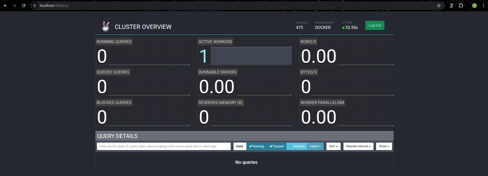
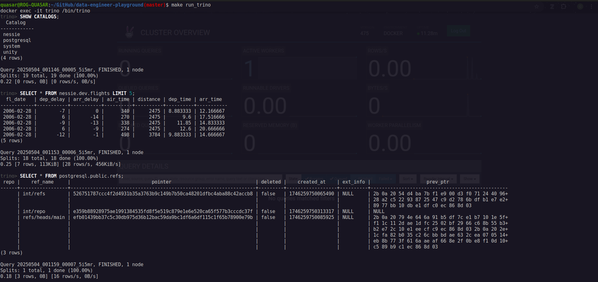

# Data Engineer Playground

A learner-focused, Docker-based environment for exploring core data engineering tools and open table formats. Spin up each service individually, understand its role, and build end-to-end data workflows.

---

This documentation covers the services defined in the `docker-compose.yml` and how to get started with each of those services.

## Prerequisites

- **Make sure you have installed Docker and Git** locally.
- Basic understanding of how Docker containers works (not mandatory).
- Clone this repo and copy the environment template:
  ```bash
  git clone git@github.com:vinay-ram1999/data-engineer-playground.git
  cd data-engineer-playground
  cp sample.env .env
  ```

# Services

Below, each tool is documented with a brief overview, startup instructions, and dependencies.

## 1. MinIO (S3-Compatible Storage)

**Overview:**
MinIO provides S3-compatible object storage, serving as the data lake store for Spark, Trino, and other services.

**Setup:**
```bash
docker compose up -d minio
```
- Browser UI: http://localhost:9001 (user: `minioadmin` | password: `minioadmin`)
- API endpoint: http://localhost:9000

**Note:**
- On startup, files in `data/` are seeded into bucket `seed`.


## 2. PostgreSQL & pgAdmin

**Overview:**
PostgreSQL serves as the backend database for Nessie Catalog and Apache Airflow. pgAdmin lets you query it directly or you can also use Trino to query the data from postgres database (covered in later sections).

**Setup:**
```bash
docker compose up -d postgres pgadmin
```
- You can find the PostgreSQL JDBC connector URI variable `DB_JDBC_URI` in the `.env` file.
- pgAdmin UI: http://localhost:5050 (email: `admin@example.com` | password: `secret123`)

**Note:**
- The default database schema in postgres is set to `public` so all the tables created by Nessie/Airflow can be found under this database schema.
- To view this database in pgAdmin the credentials are (user:`pgadmin` | password: `pgadmin`)


## 3. Nessie Catalog

**Overview:**
Project Nessie offers a Git-like catalog for table versions (e.g., Apache Iceberg). It is an in-memory catalog and uses the Postgres database as it's backend to persist the data accross restarts.

**Setup:**
```bash
docker compose up -d nessie
```
- Nessie UI: http://localhost:19120


## 4. Unity Catalog OSS (Server & UI)

**Overview:**
Unity Catalog OSS is an open-source, universal data and AI catalog that provides unified governance and access control for data and AI assets across various cloud platforms, data formats, and compute engines.

**Setup:**
```bash
docker compose up -d unity unity-ui
```
- Unity Server API: http://localhost:8085
- Unity UI: http://localhost:3000


**Note:**
- The integration of unity catalog with other services like Spark and Trino is still a work-in-progress.
- The unity catalog when implemented on the local system works fine but when it is implemented as a docker container I am facing some issues while integrating it with other services (any inputs from the community is highly encouraged).
- Howerever, we can still interact with it using the Unity CLI and it works fine.
- Some usefull resources to understand Unity Catalog along with the official [documentation](https://docs.unitycatalog.io/) include this [online book](https://books.japila.pl/unity-catalog-internals/).

## 5. Apache Spark

**Overview:**
Spark is a multi-language big data processing enginer and this sevice runs a Spark version 3.5.5 along with a Jupyter Notebook environment where you can run spark jobs using the `pyspsrk` library.

**Dependencies:**
- This service uses minio as an object storage and nessie catalog in order to work with Iceberg tables.

**Setup:**
```bash
docker compose up -d spark
```
- Jupyter Lab: http://localhost:8888
- Spark Master UI: http://localhost:8082
- Spark Master for submitting jobs: http://localhost:7077
- Spark History Server: http://localhost:18080


**Note:**
- **The integration with unity Catalog is still a work-in-progress**.
- The python scripts in `spark/seed/` directory can be accessed in the Jupyter Notebook environment to run.


## 6. Trino

**Overview:**
Trino is a distributed SQL query engine for interactive analytics and can query data from various scources including traditional databases and open table formats like Iceberg/Delta tables located in a data lake by accessing the metadata from catalogs.

**Setup:**
```bash
docker compose up -d trino

# To run queries on the trino cluster
docker exec -it trino /bin/trino

# Or you can run the following make command
make run_trino
```
- Trino UI: http://localhost:8080



**Usage:**
- The trino server configs and the connectors are located in `trino/etc/` directory.
- You can also connect the trino cluster to your DBeaver Community edition for a GUI to run quries.


## 7. Apache Airflow

**Overview:**
Apache Airflow is a workflow orchestration platform for scheduling and monitoring ETL pipelines.

**Setup:**
```bash
docker compose up -d airflow-apiserver airflow-scheduler airflow-dag-processor airflow-triggerer

# Or you can run the following make command
make up_airflow
```
- Airflow Web UI: http://localhost:8088 (user: `airflow` | password: `airflow`)


## Teardown

Stop the containers:
```bash
docker compose stop <service-name>
```

Start/re-start the containers:
```bash
docker compose start <service-name>
```

Stop and remove all containers, networks, and volumes (This will remove all the volumes and all persited data will be lost):
```bash
docker compose down --volumes
```


# Demo

## 1. Getting started with sample data (spark + nessie + minio)

In `data` directory there is a sample data file which is automatically loaded into the minio `seed` buckent when you spol up the service. We will be using that sample data and create an Iceberg table using spark.

1. Make sure you have spark, nessie, postgres (used by nessie as a backend DB) and minio services up and running.

2. Now, you need to open you Jupyter notebook environment (http://localhost:8888) and open `/seed/nessie/iceberg_DDL.ipynb` file.


3. Run all the cells in this notebook and after it runs successfully you can see that a new table named `flights` is created in nessie catalog and you can see the data in minio `nessie` bucket and the table metadata on nessie catalog UI as well.


## 2. Using Trino to query the sample data (trino + nessie + minio)

Now you can query the Iceberg table created by the spark job or the metadata created by nessie catalog in the Postgres database. 

1. Make sure you have trino, nessie, postgres and minio services are up and running.

2. You can use the trino CLI to query the data. Follow the commads executed in the images below to view the data.



3. Instead of using CLI you can query the data from DBeaver Community edition as well!


## 3. Using pgAdmin to query data from Postgres DB (postgres + pgadmin)

1. Make sure you have postgres and pgadmin services are up and running.

2. You can query the tables created by nessie catalog or aiflow.


## 4. Unity Catalog CLI and Trino (unity + trino)

As of now, the data from unity catalog default tables can only be read using the unity catalogs' CLI.


**Note:** Unity catalog also offers an IcebergREST API which can be used to connect to trino. The unity catalog integration with spark is also a work-in-progress currently.


# Contributing & License

Feel free to open issues or PRs. This project is under the MIT License. See [LICENSE](LICENSE).

